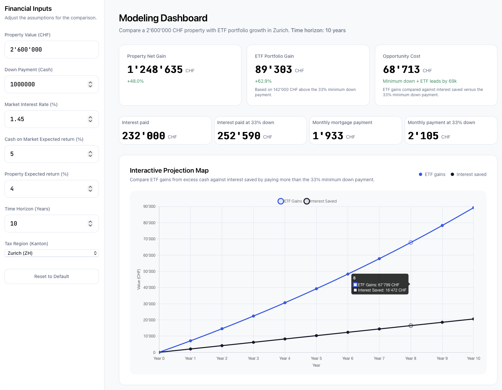

# Property Financing Calculator

This app is a small single-page calculator for comparing two ways to use your cash when buying property in Switzerland:

- Put more cash into the property as a larger down payment
- Keep only the minimum down payment and invest the remaining cash in the market

It helps answer a practical question: over a chosen time horizon, does extra equity in the property save more money than investing that extra cash elsewhere?

## Run It

Open `src/index.html` in a browser.

## Notes

- the current implementation models an interest-only mortgage
- the minimum down payment in the app is 33%
- tax region selection exists in the UI, it is for the wealth tax, but it does not work.
